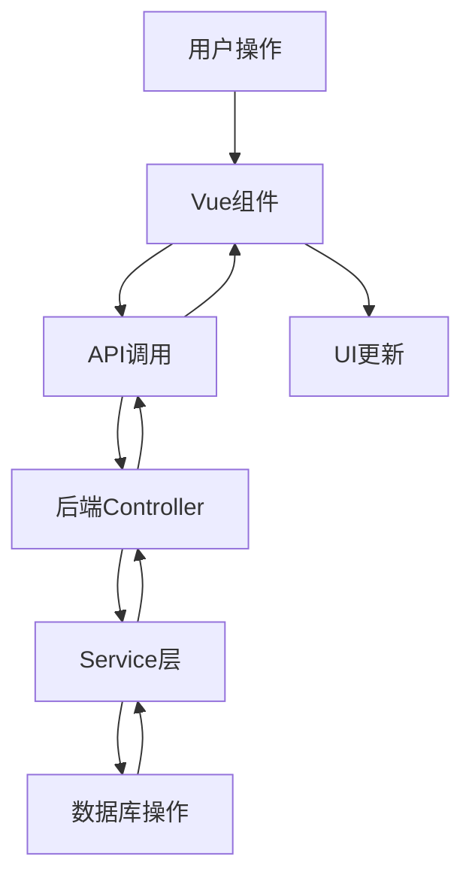

# 区域配置系统设计文档

**制定日期**: 2025-06-22  
**版本**: v1.0  
**模块**: 管理后台 - 区域配置系统

## 1. 概述

区域配置系统是巡检管理系统的核心配置模块，用于管理数据中心和弱电间两种类型的巡检区域。该系统支持区域的创建、编辑、删除、模块配置等功能，为巡检业务提供基础数据支持。

## 2. 功能模块

### 2.1 区域管理
- **区域列表**: 支持分页、筛选、搜索
- **区域新增**: 支持数据中心(D)和弱电间(E)两种类型
- **区域编辑**: 支持基本信息修改
- **区域删除**: 支持逻辑删除，保留历史数据

### 2.2 模块配置（数据中心专用）
- **模块数量配置**: 支持1-20个模块
- **模块类型配置**: 计算模块、存储模块、网络模块
- **模块名称配置**: 自定义模块名称
- **配置JSON存储**: 灵活的配置数据结构

### 2.3 系统参数配置
- **基础设置**: 系统名称、版本信息
- **会话管理**: 超时时间配置
- **安全设置**: 相关安全参数

### 2.4 AD域集成配置
- **服务器配置**: LDAP服务器地址和端口
- **域配置**: 域名和认证信息
- **连接测试**: 验证AD连接状态

## 3. 数据库设计

### 3.1 区域表 (t_area)
```sql
CREATE TABLE t_area (
    id BIGINT AUTO_INCREMENT PRIMARY KEY COMMENT '区域ID',
    code VARCHAR(50) NOT NULL UNIQUE COMMENT '区域编码',
    name VARCHAR(100) NOT NULL COMMENT '区域名称',
    description TEXT COMMENT '区域描述',
    address VARCHAR(200) COMMENT '区域地址',
    type VARCHAR(50) COMMENT '区域分类（预留字段）',
    area_type ENUM('D', 'E') NOT NULL DEFAULT 'D' COMMENT '区域类型：D-数据中心，E-弱电间',
    module_count INT DEFAULT 0 COMMENT '模块数量（仅数据中心使用）',
    config_json TEXT COMMENT '区域配置信息（JSON格式）',
    status VARCHAR(20) DEFAULT 'active' COMMENT '区域状态：active-活跃，inactive-未激活',
    qr_code_url VARCHAR(500) COMMENT '区域二维码URL',
    create_time DATETIME DEFAULT CURRENT_TIMESTAMP COMMENT '创建时间',
    update_time DATETIME DEFAULT CURRENT_TIMESTAMP ON UPDATE CURRENT_TIMESTAMP COMMENT '更新时间',
    deleted TINYINT DEFAULT 0 COMMENT '是否删除：0-未删除，1-已删除'
);
```

### 3.2 配置JSON结构
```json
{
  "modules": [
    {
      "id": 1,
      "name": "模块1",
      "type": "compute"
    },
    {
      "id": 2,
      "name": "模块2", 
      "type": "storage"
    }
  ],
  "settings": {
    "temperature_threshold": 25,
    "humidity_threshold": 60
  }
}
```

## 4. API接口设计

### 4.1 区域管理接口

#### 4.1.1 获取区域列表
- **接口**: `GET /api/v1/areas`
- **参数**: 
  - `page`: 页码 (默认1)
  - `size`: 每页大小 (默认10)
  - `type`: 区域类型筛选 (D/E)
  - `keyword`: 搜索关键字
  - `status`: 状态筛选
- **响应**:
```json
{
  "code": 200,
  "message": "success",
  "data": {
    "records": [
      {
        "id": 1,
        "areaCode": "DC001",
        "areaName": "数据中心1",
        "areaType": "D",
        "moduleCount": 4,
        "status": "active",
        "createTime": "2025-06-22 10:00:00"
      }
    ],
    "total": 10,
    "current": 1,
    "size": 10
  }
}
```

#### 4.1.2 创建区域
- **接口**: `POST /api/v1/areas`
- **请求体**:
```json
{
  "areaCode": "DC002",
  "areaName": "数据中心2",
  "areaType": "D",
  "address": "北京市朝阳区",
  "description": "新建数据中心"
}
```

#### 4.1.3 更新区域
- **接口**: `PUT /api/v1/areas/{id}`
- **请求体**: 同创建区域

#### 4.1.4 删除区域
- **接口**: `DELETE /api/v1/areas/{id}`

### 4.2 模块配置接口

#### 4.2.1 更新区域配置
- **接口**: `PUT /api/v1/areas/{id}/config`
- **请求体**:
```json
{
  "moduleCount": 4,
  "configJson": "{\"modules\":[{\"id\":1,\"name\":\"模块1\",\"type\":\"compute\"}]}"
}
```

#### 4.2.2 获取区域详情
- **接口**: `GET /api/v1/areas/code/{areaCode}`
- **响应**: 包含完整区域信息和模块配置

## 5. 前端组件设计

### 5.1 主要组件

#### 5.1.1 AreaConfig.vue
- **功能**: 区域配置主界面
- **包含**: Tab切换、区域列表、新增/编辑弹窗
- **状态管理**: 
  - `areas`: 区域列表数据
  - `activeTab`: 当前激活的Tab
  - `searchForm`: 搜索表单数据

#### 5.1.2 AreaList组件
- **功能**: 区域卡片列表展示
- **特性**: 
  - 网格布局
  - 类型标识
  - 操作按钮

#### 5.1.3 AreaForm组件
- **功能**: 区域新增/编辑表单
- **字段**: 名称、编码、类型、地址、描述
- **验证**: 必填项验证、格式验证

#### 5.1.4 ModuleConfig组件
- **功能**: 数据中心模块配置
- **特性**:
  - 动态模块数量
  - 模块类型选择
  - 模块名称配置

### 5.2 数据流设计



## 6. 实现细节

### 6.1 字段映射处理
由于Area实体类和AreaDTO字段名不匹配，需要手动映射：
- `Area.areaCode` ↔ `AreaDTO.areaCode`
- `Area.name` ↔ `AreaDTO.areaName`
- `Area.areaType` ↔ `AreaDTO.areaType`

### 6.2 模块配置存储
- 使用JSON格式存储在`config_json`字段
- 前端解析JSON展示模块列表
- 支持动态增减模块数量

### 6.3 搜索和筛选
- 支持按区域类型筛选
- 支持按名称/编码搜索
- 前端实现筛选逻辑，减少后端压力

## 7. 安全考虑

### 7.1 权限控制
- 仅管理员可访问区域配置功能
- API接口需要管理员权限验证
- 敏感操作需要二次确认

### 7.2 数据验证
- 前端表单验证
- 后端参数验证
- 数据库约束验证

### 7.3 操作审计
- 记录关键操作日志
- 追踪配置变更历史
- 异常操作告警

## 8. 性能优化

### 8.1 前端优化
- 区域列表分页加载
- 图片懒加载
- 组件按需加载

### 8.2 后端优化
- 数据库索引优化
- 查询结果缓存
- 分页查询优化

### 8.3 用户体验
- 加载状态提示
- 操作成功反馈
- 错误信息友好提示

## 9. 测试策略

### 9.1 单元测试
- Service层业务逻辑测试
- 工具类方法测试
- 数据转换测试

### 9.2 集成测试
- API接口测试
- 数据库操作测试
- 端到端流程测试

### 9.3 用户测试
- 功能操作测试
- 界面交互测试
- 兼容性测试

## 10. 部署和维护

### 10.1 部署要求
- MySQL 5.7+
- Spring Boot 2.7+
- Vue 3 + Ant Design Vue

### 10.2 监控指标
- API响应时间
- 数据库查询性能
- 用户操作统计

### 10.3 故障处理
- 数据备份恢复
- 配置回滚机制
- 异常处理流程

## 11. 未来扩展

### 11.1 功能扩展
- 支持更多区域类型
- 批量操作功能
- 配置模板功能

### 11.2 技术扩展
- 微服务架构改造
- 配置中心集成
- 实时配置推送

### 11.3 集成扩展
- 第三方系统集成
- API开放平台
- 数据同步机制 