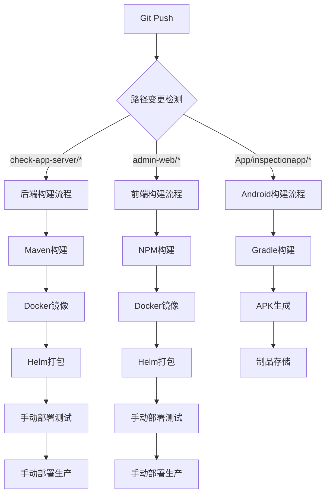

# 多工程 CI/CD 设计方案

**文档编号**: 043  
**创建日期**: 2025-01-27  
**更新日期**: 2025-01-27  
**版本**: v1.0  

## 📋 需求分析

### 业务需求
- **多工程独立构建**: check-app-server、admin-web、Android App 三个工程独立触发构建
- **路径变更检测**: 只有相关子目录有变更时才触发对应工程的构建
- **手动部署控制**: 测试环境和生产环境部署均需手动触发
- **容器化构建**: 所有工程都基于容器化方式构建，包括 Android APK

### 技术需求
- **基于现有模板**: 复用 `gitlab-ci-ref.yaml` 的构建模式
- **Docker 镜像管理**: 统一的镜像仓库和版本管理
- **Helm 部署**: 后端和前端使用 Helm Chart 部署
- **APK 构建**: Android 应用容器化构建生成 APK

## 🏗️ 架构设计

### CI/CD 流程架构



### 项目结构
```
check-app/
├── check-app-server/          # 后端服务
│   ├── Dockerfile
│   ├── helm/
│   └── pom.xml
├── admin-web/                 # 管理后台
│   ├── Dockerfile
│   ├── deploy/
│   └── package.json
├── App/inspectionapp/         # Android 应用
│   ├── Dockerfile.android
│   ├── app/
│   └── build.gradle
└── .gitlab-ci.yml            # 根目录CI配置
```

## 🔧 技术方案

### 1. 路径变更检测策略

#### 方案一：GitLab CI rules + changes (推荐)
```yaml
rules:
  - changes:
      - "check-app-server/**/*"
    when: on_success
```

#### 方案二：脚本检测
```bash
# 检测路径变更的脚本
if git diff --name-only $CI_COMMIT_BEFORE_SHA $CI_COMMIT_SHA | grep -q "^check-app-server/"; then
  echo "后端代码有变更，触发构建"
fi
```

### 2. 多工程构建策略

#### Stage 设计
```yaml
stages:
  - detect_changes      # 变更检测
  - build_backend      # 后端构建
  - build_frontend     # 前端构建
  - build_android      # Android构建
  - package           # 打包阶段
  - deploy_test       # 测试环境部署
  - deploy_prod       # 生产环境部署
```

#### 并行构建
- 三个工程可以并行构建，互不影响
- 使用 GitLab CI 的 `needs` 关键字管理依赖关系
- 避免不必要的资源浪费

### 3. Android 容器化构建方案

#### Docker 镜像选择
```dockerfile
FROM openjdk:11-jdk

# 安装 Android SDK
ENV ANDROID_SDK_ROOT /opt/android-sdk
ENV PATH ${PATH}:${ANDROID_SDK_ROOT}/tools:${ANDROID_SDK_ROOT}/platform-tools

# 下载并安装 Android SDK
RUN mkdir -p ${ANDROID_SDK_ROOT} && \
    cd ${ANDROID_SDK_ROOT} && \
    wget -q https://dl.google.com/android/repository/commandlinetools-linux-8512546_latest.zip && \
    unzip commandlinetools-linux-8512546_latest.zip && \
    rm commandlinetools-linux-8512546_latest.zip
```

#### 构建流程
1. **环境准备**: Android SDK + Gradle
2. **依赖下载**: Gradle 依赖缓存
3. **代码编译**: `./gradlew assembleRelease`
4. **APK 签名**: 使用密钥库签名
5. **制品存储**: 上传到 GitLab Artifacts

### 4. 部署策略

#### 后端服务部署
- **镜像**: 基于 Spring Boot 的 Docker 镜像
- **部署方式**: Helm Chart 部署到 Kubernetes
- **配置管理**: ConfigMap + Secret
- **服务发现**: Kubernetes Service

#### 前端服务部署
- **镜像**: 基于 Nginx 的静态文件镜像
- **部署方式**: Helm Chart 部署到 Kubernetes
- **反向代理**: Nginx 配置 API 代理
- **静态资源**: CDN 加速

#### Android 应用分发
- **制品存储**: GitLab Package Registry
- **版本管理**: 基于 Git Tag 版本号
- **分发方式**: 内部应用商店或直接下载

## 📦 实现细节

### GitLab CI 配置结构

#### 主配置文件 (.gitlab-ci.yml)
```yaml
include:
  - local: 'check-app-server/.gitlab-ci-backend.yml'
  - local: 'admin-web/.gitlab-ci-frontend.yml'
  - local: 'App/inspectionapp/.gitlab-ci-android.yml'

stages:
  - build
  - package
  - deploy_test
  - deploy_prod

variables:
  REGISTRY_ADDRESS: ${REGISTRY_ADDRESS}
  REGISTRY_USERNAME: ${REGISTRY_USERNAME}
  REGISTRY_PASSWORD: ${REGISTRY_PASSWORD}
```

#### 后端 CI 配置
- **触发条件**: `check-app-server/**/*` 路径变更
- **构建工具**: Maven + Docker
- **部署目标**: Kubernetes Cluster

#### 前端 CI 配置
- **触发条件**: `admin-web/**/*` 路径变更
- **构建工具**: NPM + Docker
- **部署目标**: Kubernetes Cluster

#### Android CI 配置
- **触发条件**: `App/inspectionapp/**/*` 路径变更
- **构建工具**: Gradle + Android SDK
- **输出产物**: APK 文件

### 环境变量管理

#### 项目级变量
```yaml
variables:
  # 镜像仓库配置
  REGISTRY_ADDRESS: harbor-internal.ppp.com
  
  # 后端服务配置
  BACKEND_IMAGE_NAME: check-app/check-app-server
  BACKEND_NAMESPACE: check-app
  BACKEND_CHART_NAME: check-app-server
  
  # 前端服务配置
  FRONTEND_IMAGE_NAME: check-app/admin-web
  FRONTEND_NAMESPACE: check-app
  FRONTEND_CHART_NAME: admin-web
  
  # Android 应用配置
  ANDROID_APP_NAME: inspection-app
  ANDROID_VERSION_CODE: ${CI_PIPELINE_ID}
```

#### 敏感信息管理
- **Kubernetes 配置**: `KUBECONFIG` (Base64 编码)
- **镜像仓库凭据**: `REGISTRY_USERNAME` / `REGISTRY_PASSWORD`
- **Android 签名密钥**: `ANDROID_KEYSTORE` / `ANDROID_KEY_PASSWORD`

### 缓存策略

#### Maven 缓存 (后端)
```yaml
cache:
  key: maven-$CI_PROJECT_ID
  paths:
    - .m2/repository/
```

#### NPM 缓存 (前端)
```yaml
cache:
  key: npm-$CI_PROJECT_ID
  paths:
    - node_modules/
    - .npm/
```

#### Gradle 缓存 (Android)
```yaml
cache:
  key: gradle-$CI_PROJECT_ID
  paths:
    - .gradle/
    - build/
```

## 🚀 部署流程

### 手动部署控制

#### 测试环境部署
- **触发方式**: 手动点击按钮
- **分支限制**: `dev` 和 `master` 分支
- **依赖关系**: 必须先完成构建和打包

#### 生产环境部署
- **触发方式**: 手动点击按钮
- **分支限制**: `master` 分支或 Git Tag
- **依赖关系**: 必须先完成测试环境部署

### 回滚策略
- **Helm Rollback**: 使用 Helm 回滚到上一个版本
- **镜像版本**: 保留最近 10 个版本的镜像
- **数据库迁移**: 准备回滚脚本

## 📊 监控和日志

### 构建监控
- **构建时间**: 监控各阶段构建耗时
- **成功率**: 统计构建成功率
- **资源使用**: 监控 CPU 和内存使用

### 部署监控
- **部署状态**: 实时监控部署进度
- **健康检查**: 服务启动后健康检查
- **性能指标**: 应用性能监控

### 日志管理
- **构建日志**: GitLab CI 日志保留
- **应用日志**: 集中日志收集
- **错误告警**: 异常情况自动告警

## 🔒 安全考虑

### 镜像安全
- **基础镜像**: 使用官方或信任的基础镜像
- **漏洞扫描**: 定期扫描镜像漏洞
- **最小权限**: 容器运行时最小权限

### 密钥管理
- **GitLab Variables**: 敏感信息使用受保护变量
- **Kubernetes Secrets**: 运行时密钥管理
- **密钥轮换**: 定期更换密钥

### 网络安全
- **网络策略**: Kubernetes NetworkPolicy
- **TLS 加密**: 服务间通信加密
- **访问控制**: RBAC 权限控制

## 📈 性能优化

### 构建优化
- **并行构建**: 多工程并行执行
- **缓存利用**: 充分利用构建缓存
- **增量构建**: 只构建变更的部分

### 部署优化
- **滚动更新**: 零停机部署
- **健康检查**: 快速故障检测
- **资源限制**: 合理的资源配置

## 🎯 成功指标

### 构建效率
- **构建时间**: < 10 分钟 (后端/前端), < 15 分钟 (Android)
- **成功率**: > 95%
- **并发能力**: 支持 3 个工程同时构建

### 部署效率
- **部署时间**: < 5 分钟
- **回滚时间**: < 2 分钟
- **可用性**: > 99.9%

### 开发体验
- **触发准确性**: 只触发相关工程构建
- **反馈及时性**: 构建结果及时通知
- **操作简便性**: 一键部署

## 📋 实施计划

### 阶段一：基础架构 (1天)
- [ ] 创建主 CI 配置文件
- [ ] 设计各工程 CI 子配置
- [ ] 配置环境变量和密钥

### 阶段二：后端 CI/CD (1天)
- [ ] 实现后端构建流程
- [ ] 配置 Helm 部署
- [ ] 测试部署流程

### 阶段三：前端 CI/CD (1天)
- [ ] 实现前端构建流程
- [ ] 配置 Nginx 部署
- [ ] 测试部署流程

### 阶段四：Android CI/CD (1天)
- [ ] 创建 Android 构建环境
- [ ] 实现 APK 构建流程
- [ ] 配置制品存储

### 阶段五：集成测试 (1天)
- [ ] 端到端测试
- [ ] 性能测试
- [ ] 安全测试

## 🔄 维护和升级

### 定期维护
- **依赖更新**: 定期更新构建工具和依赖
- **镜像更新**: 更新基础镜像到最新版本
- **配置优化**: 根据使用情况优化配置

### 监控和告警
- **构建失败告警**: 及时通知构建失败
- **部署异常告警**: 监控部署状态
- **性能监控**: 持续监控系统性能

---

**总结**: 本方案通过路径变更检测实现多工程独立构建，使用容器化技术统一构建环境，通过手动触发控制部署节奏，确保系统的稳定性和可控性。 